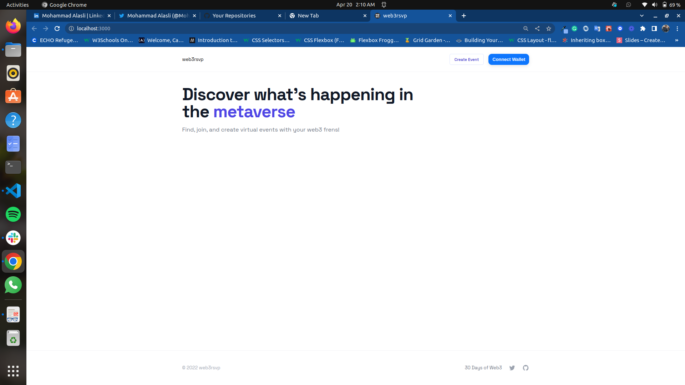

# Web3RSVP-frontend

## Dapp deom (by 30 days of web3)

we will build a frontend for our dapp using React, Next.js, ethers.js, Rainbowkit, Web3.Storage, and The Graph. Our app will work with Coinbase Wallet or other user-controlled wallets like MetaMask, Rainbow, and WalletConnect. Users will be able to connect their wallet and interact with our smart contract so they can create new events, RSVP to events, and confirm attendees.

### Quick start:

1. Clone the repo

2. cd to the project in your terminal

3. Run the command `npm i` to Install dependencies

4. Run the development server

```bash
npm run dev
```

-   **Wallet**: _Coinbase_

-   **Testnet**: _Mumbai_




